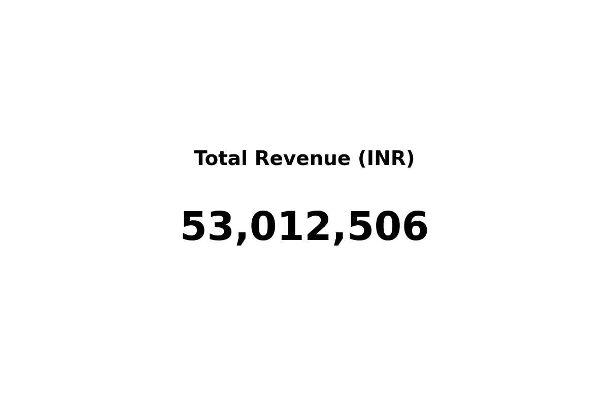
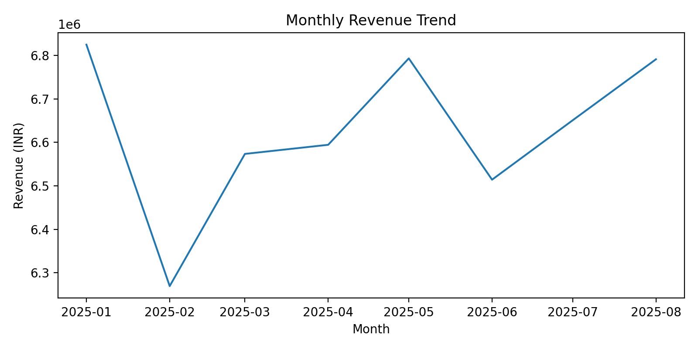
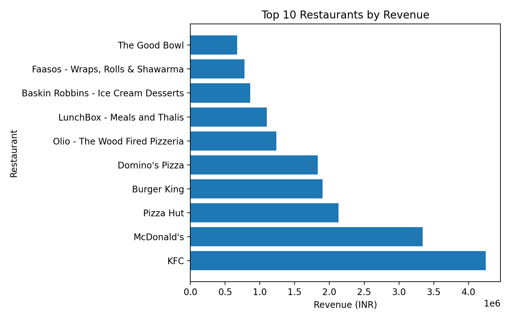
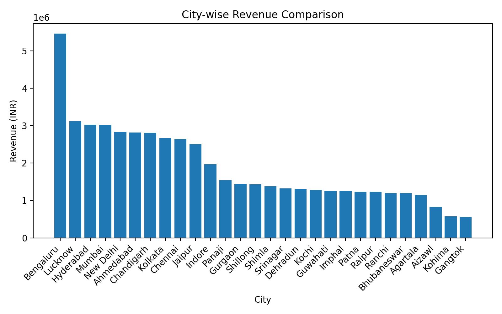

# Swiggy Sales & Restaurant Performance Analysis  
### SQL Server & Power BI Portfolio Project

## 📌 Project Overview
This project is an end-to-end data analysis of Swiggy food delivery data using **SQL Server (T-SQL)** and **Power BI**.  
The objective is to extract meaningful business insights related to **revenue performance, restaurant ranking, city-wise trends, and customer pricing behavior** from raw transactional data.

The project simulates a **real-world analytics scenario**, where data is cleaned, validated, analyzed using SQL, and visualized through an executive-style Power BI dashboard.

## Power BI Dashboard Preview

---

## 🎯 Business Objectives
The analysis focuses on answering key business questions such as:
- Which restaurants generate the highest revenue?
- How does revenue trend over time?
- Which cities contribute most to overall sales?
- How do ratings relate to pricing?
- Which restaurants perform best within each city?

---

## 🛠 Tools & Technologies
- **SQL Server (T-SQL)** – data modeling, data quality checks, analysis, and views  
- **Power BI** – KPI reporting and interactive dashboards  
- **Excel** – source data format  

---

## 🧱 Project Structure
The project is structured to reflect a professional analytics workflow:
- Database schema creation
- Data quality validation
- Revenue and performance analysis
- Advanced SQL using window functions
- SQL views optimized for Power BI reporting
- Business insight generation

---

## 📊 Dashboard Highlights
The Power BI dashboard includes:
- Total Revenue KPI
- Monthly Revenue Trend
- Top Restaurants by Revenue
- City-wise Revenue Comparison
- Pricing and rating insights

---

## 💼 Key Skills Demonstrated
- SQL joins, aggregations, and filtering  
- Data quality checks and validation  
- Time-series analysis  
- Window functions (RANK, PARTITION BY)  
- SQL views for BI tools  
- Business insight storytelling  

---

## 🚀 Outcome
This project demonstrates my ability to work with real-world data, translate business requirements into SQL queries, and present insights through clear, decision-ready visualizations.

It is designed to reflect the type of analytical work expected from a **junior to intermediate data analyst** in a production environment.
